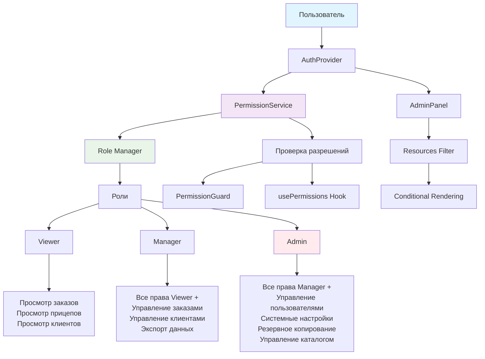
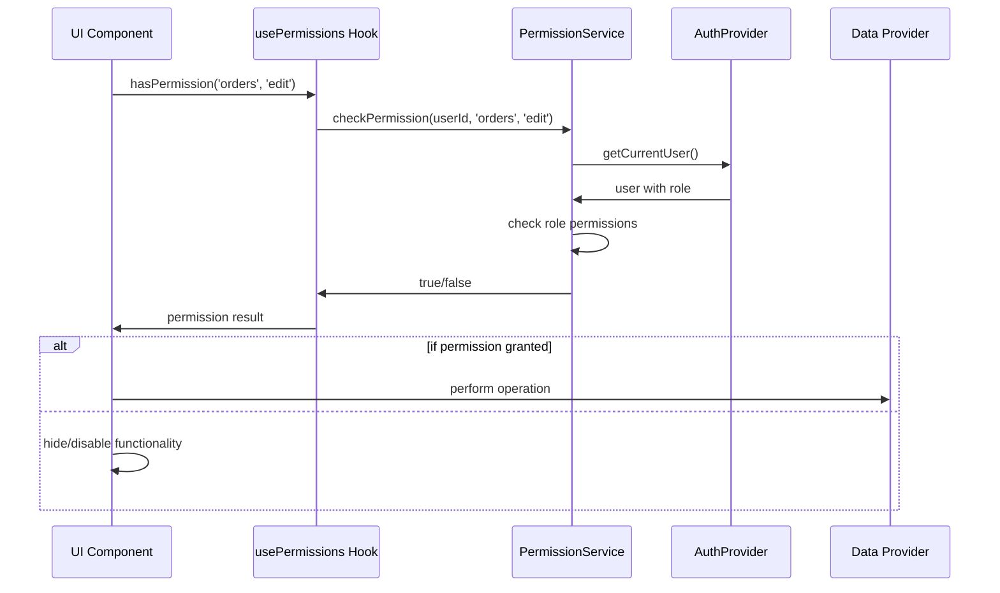

# Архитектура системы разрешений



## Поток проверки разрешений



## Структура ролей

```mermaid
graph LR
    A[Viewer] --> A1[orders: view]
    A --> A2[trailers: view]
    A --> A3[customers: view]
    
    B[Manager] --> B1[orders: view,create,edit,export]
    B --> B2[customers: view,create,edit,export]
    B --> B3[trailers: view,export]
    
    C[Admin] --> C1[users: all]
    C --> C2[settings: view,edit]
    C --> C3[backup: view,create,restore]
    C --> C4[catalog: all]
    
    style A fill:#e3f2fd
    style B fill:#e8f5e8
    style C fill:#ffebee